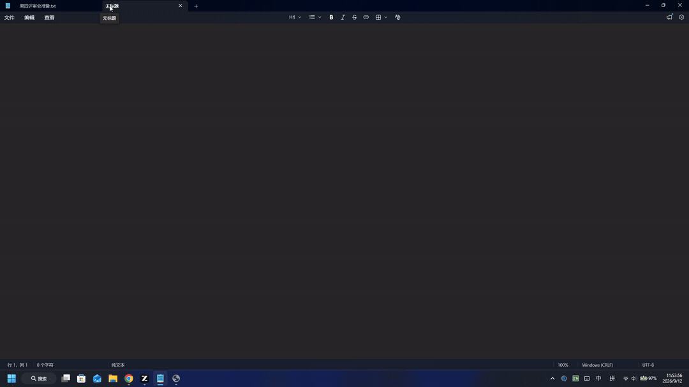

# SnapStep 📸

**按一次快捷键，把你的操作变成图文教程。**
Record your screen, get a step-by-step guide — automatically.

[](https://github.com/Felixssss-106/snapstep/actions/workflows/test.yml)
[](LICENSE)
[](pyproject.toml)



SnapStep 在后台监听你的鼠标和键盘：每次点击自动截图并标记位置，输入的文本自动记录。
停止录制后，一份带序号截图的图文教程就生成好了 —— 支持 **Markdown / HTML / Word**，
可选接入大模型把文案写得更自然。**开源版 Scribe / Tango 平替，数据不出你的电脑。**

---

## ✨ 特性

- **一键录制**：系统托盘常驻，全局快捷键（默认 `Ctrl+Alt+S`）随时开始/停止
- **自动截屏标注**：点击处自动画高亮圈 + 步骤序号，输入的文本自动记进步骤里
- **三种导出**：Markdown（贴 wiki/仓库）、HTML（单文件内嵌截图，直接发人）、Word（正式文档）
- **AI 文案（可选）**：填一个 OpenAI 兼容 API 即可让大模型写标题和步骤描述，
  预设支持 GLM / DeepSeek / OpenAI，本地模型（Ollama / LM Studio）也行
- **零配置可用**：不配 AI 也能用，本地模板自动生成每步文案
- **隐私优先**：本机处理，无任何遥测；隐私模式一键停止截屏；密码框输入自动隐藏（尽力检测）

## 📦 安装

**Windows（推荐）**：从 [Releases](https://github.com/Felixssss-106/snapstep/releases) 下载 `SnapStep.exe`，双击即用。

**pip**：

```bash
pip install snapstep
snapstep          # 启动托盘 GUI
```

**从源码**：

```bash
git clone https://github.com/Felixssss-106/snapstep.git
cd snapstep
pip install -e ".[dev]"
pytest            # 跑测试
```

## 🚀 快速开始

### 托盘 GUI（默认）

启动后托盘出现图标：

1. 按 `Ctrl+Alt+S`（或托盘菜单「开始录制」）
2. 像平常一样操作 —— 每次左键点击自动成为一步
3. 再按 `Ctrl+Alt+S` 停止，教程自动导出并弹窗提示

右键托盘图标可打开会话文件夹、重新导出、修改设置。

### 命令行

```bash
snapstep record                     # 录制，回车结束，自动导出
snapstep record --format md --no-ai # 指定格式、跳过 AI
snapstep export ~/.snapstep/sessions/20260912-101010 -f all   # 导出已有会话
snapstep config set api.base_url https://api.deepseek.com/v1  # 命令行改配置
snapstep demo                       # 不录制，直接生成一份示例教程验证安装
```

## 🤖 AI 文案配置

设置界面选预设填 API Key 即可；也可命令行：

```bash
snapstep config set api.base_url https://open.bigmodel.cn/api/paas/v4
snapstep config set api.model glm-4-flash
snapstep config set api.api_key 你的key
```

| 预设 | Base URL | 模型示例 |
|---|---|---|
| GLM 智谱 | `https://open.bigmodel.cn/api/paas/v4` | `glm-4-flash` |
| DeepSeek | `https://api.deepseek.com/v1` | `deepseek-chat` |
| OpenAI | `https://api.openai.com/v1` | `gpt-4o-mini` |
| 本地模型 | `http://127.0.0.1:11434/v1` | Ollama / LM Studio 任意模型 |

不配置或调用失败时自动退回本地模板文案，**教程永远能生成**。

## 🔒 隐私设计

- 截图、文案、导出全部在本机完成；只有你主动配置了 AI 才会把**操作文字摘要**发给该 API
- 「隐私模式」：完全不截屏，只记录步骤文字
- 「密码隐藏」：通过 Windows UI Automation 尽力识别密码框，其中的键入以 `••••` 代替
- API 端点仅允许 http/https，并阻止云元数据地址与重定向，防止密钥被转发
- 配置与数据都在 `~/.snapstep/`，删掉目录即彻底清除

## 🆚 与在线 SaaS 工具对比

| | SnapStep | Scribe / Tango |
|---|---|---|
| 价格 | 免费开源（MIT） | 免费档限步数，完整功能按席位付费 |
| 数据 | 全程本机 | 操作录屏上传云端 |
| 离线 | 完全可用（无 AI 模式） | 不可用 |
| 导出 | Markdown / HTML / Word | 受付费档限制 |
| AI | 自带 key，任意 OpenAI 兼容模型 | 内置不可换 |
| 平台 | Windows（macOS 在路线图） | 浏览器扩展 |

## 🗺 Roadmap

- [ ] 录屏讲解语音 → 自动转写进步骤文案（ASR）
- [ ] AI 视觉模型读懂截图，写出更准确的按钮/控件描述
- [ ] 敏感信息智能打码（手机号/邮箱/头像区域）
- [ ] PDF 导出、团队模板
- [ ] macOS 支持

欢迎按 [issues](https://github.com/Felixssss-106/snapstep/issues) 提需求。

## 🧪 开发

```bash
pip install -e ".[dev]"
pytest                       # 测试
ruff check src tests scripts # lint
python scripts/make_icon.py  # 重新生成图标
pyinstaller snapstep.spec    # 本地打包 exe
```

架构速览：`recorder.py`（pynput 钩子 + 事件聚合）→ `capture.py`（mss 截屏 + Pillow 标注）
→ `writer.py`（AI/模板双路文案）→ `export/`（md/html/docx）。核心逻辑不依赖输入钩子，纯逻辑可单测。

## 🤝 贡献

Issue / PR 都欢迎。提交前请跑通 `pytest` 和 `ruff check`。

## License

[MIT](LICENSE)

---

## English

**SnapStep** turns your on-screen actions into a polished, screenshot-annotated
step-by-step guide — press a hotkey, do your work, press it again.

- Global hotkey recording from the system tray (`Ctrl+Alt+S` by default)
- Every click becomes a step: auto screenshot with a highlighted ring and step number,
  typed text is captured into the step
- Export to **Markdown**, a single-file **HTML** page (base64-embedded shots), or **Word**
- Optional AI copywriting via any OpenAI-compatible API (GLM / DeepSeek / OpenAI /
  local Ollama & LM Studio) — with a deterministic local template as zero-config fallback
- Privacy-first: everything stays on your machine, no telemetry, password fields are
  masked on a best-effort basis, privacy mode disables screenshots entirely

```bash
pip install snapstep
snapstep demo   # generate a sample guide to verify the install
```

See the Chinese sections above for full docs — the UI is Chinese-first,
and English UI is on the roadmap. English issues/PRs are welcome!
